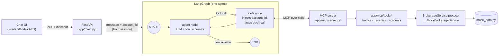

# Brokerage Customer Support Agent

An AI customer support agent for investment brokerage accounts that uses LangGraph and MCP tools to resolve customer-specific trade, transfer, and account restriction questions.

A customer asks *"Did my NVDA trade go through?"*. The agent picks the right brokerage tool, the tool returns structured account data over MCP, and the agent writes a clear answer from that data. It doesn't guess or invent anything.

Example exchange (illustrative; exact wording varies by model):

```
You:   Did my NVDA trade go through?
Agent: Yes, your NVDA order went through. Your market buy order for 10 shares
       (ORD-7F3K-1001) filled completely at an average price of $118.42.
       ── tool trace: get_trade_status {"symbol": "NVDA"} · 8 ms
```

## What it does

The agent handles the three questions that take up much of a brokerage support queue:

| Customer asks | Tool the agent calls | What comes back |
|---|---|---|
| "Did my NVDA trade go through?" | `get_trade_status` | order ID, side, quantity, status, filled qty, avg fill price, pending/rejection reason |
| "Where is the $5,000 I transferred from my checking account?" | `get_transfer_status` | transfer ID, amount, direction, status, initiated date, expected availability, failure reason |
| "Why can't I place this trade?" | `get_account_restrictions` | buying power, settled cash, unsettled funds and settlement date, restrictions, `can_trade`, blocking reasons |

**Who does what.** The core design rule is that each part does only what it is good at:

| The LLM | The application and tools |
|---|---|
| Understands the customer's question | Retrieves account data |
| Picks the tool and its filters | Returns typed, structured results |
| Writes the natural-language answer | Interprets status deterministically (e.g. "rejected because cost $3,807.50 > buying power $412.55") |
| | Validates input (tickers, IDs, quantities) |
| | Decides **whose** account is read |

The last row matters. The model never sees an `account_id` parameter. The agent strips it from every tool schema it shows the model and fills it in from the signed-in session before calling the tool. So the model can't choose another customer's account, and a prompt injection can't talk it into doing so. There's a test for this: `test_account_id_from_model_is_ignored`.

## Architecture



- **One agent, one loop:** `START → agent → tools → agent → END`. There's no multi-agent orchestration. The agent node calls the LLM, and if the LLM asks for a tool, the tools node runs it and loops back so the LLM can write the answer.
- **A real MCP boundary.** On startup, FastAPI launches the MCP server as a stdio subprocess and keeps one MCP session open (via `langchain-mcp-adapters`). The agent only knows the tools the server advertises. Moving the server to its own host later is a config change: use the streamable HTTP transport instead of stdio.
- **Tools are thin; the service holds the logic.** Each MCP tool validates its arguments, calls a `BrokerageService` method, and returns the result as JSON. `MockBrokerageService` implements that protocol against seed data. A real brokerage client would implement the same protocol, and the tool contracts, prompt, agent and UI would not change.

## Tech stack

- **Python 3.11+**
- **FastAPI** for the API and to serve the static chat page
- **LangGraph** for the agent graph (`StateGraph` with an agent node and a tools node)
- **LangChain** for the chat model interface (`langchain-anthropic`) and MCP tool adapters (`langchain-mcp-adapters`)
- **MCP** (official `mcp` Python SDK, `FastMCP`) for the brokerage tool server
- **Claude** (`claude-sonnet-5-5` by default) as the LLM, with an offline fallback (see below)
- Vanilla HTML/JS for the chat UI. There's no build step.

## Quick start

```bash
cd agents/brokerage-support-agent
python -m venv .venv && source .venv/bin/activate
pip install -r requirements.txt

cp .env.example .env          # then add your ANTHROPIC_API_KEY
uvicorn app.main:app --reload
```

Open http://localhost:8000 and click one of the suggested questions.

**No API key?** The app still runs. With `LLM_PROVIDER=auto` (the default) and no `ANTHROPIC_API_KEY`, it uses `MockBrokerageChatModel`, an offline keyword router that phrases answers from the service's deterministic explanations. It isn't an LLM, and the header badge says so. It exists so the demo, the MCP tools and the test suite all work without network access. Everything else, including the MCP subprocess, is the same code path.

| Env var | Default | Purpose |
|---|---|---|
| `LLM_PROVIDER` | `auto` | `anthropic`, `mock`, or `auto` (Anthropic if a key is set) |
| `ANTHROPIC_API_KEY` | | Anthropic API key |
| `ANTHROPIC_MODEL` | `claude-sonnet-5-5` | Any Claude model ID |
| `DEFAULT_ACCOUNT_ID` | `ACCT-DEMO-1001` | Demo customer selected on page load |

You can also run the MCP server on its own, for example to inspect it with an MCP client:

```bash
python -m app.mcp.server        # speaks MCP over stdio
```

## Demo script

Use the **Signed in as** dropdown to switch between fictional customers. Each customer is set up to show a different outcome. Open **Tool trace** under any answer to see which MCP tool ran, what arguments the model chose, what the session injected, the raw structured result, and the tool latency.

| Customer | Try asking | Outcome shown |
|---|---|---|
| Alex Rivera `ACCT-DEMO-1001` | Did my NVDA trade go through? | **FILLED**: 10 @ $118.42 |
| | What about my TSLA order? | **PENDING**: limit $265 not reached |
| | Why was my AMD order rejected? | **REJECTED**: insufficient buying power |
| | Where is the $5,000 I transferred from my checking account? | **PROCESSING**: available 2026-10-05 |
| | Did my $1,000 withdrawal go through? | **FAILED**: bank account closed (R02) |
| | Why can't I place this trade? | **Insufficient buying power** ($3,807.50 vs $412.55) |
| Jordan Lee `ACCT-DEMO-1002` | Why can't I buy 20 shares of NVDA? | **Unsettled funds**: $6,214.59 settles 2026-10-05 |
| Sam Patel `ACCT-DEMO-1003` | Why can't I place this trade? | **Account restriction**: ID verification required (sells still allowed) |
| | Where's my $5,000 deposit? | **FAILED**: insufficient funds at bank (R01) |
| Taylor Morgan `ACCT-DEMO-1004` | Can I buy 100 shares of NVDA? | **No restriction** |
| | Did my NVDA order fill? | **PARTIALLY_FILLED**: 30 of 50 |

All names, account numbers, order and transfer IDs, balances and quotes are fictional.

## The MCP tools

All three tools take an `account_id`, which the application supplies, plus optional filters, which the model supplies. They return structured JSON. Expected failures such as an unknown ticker, a malformed ID or an unknown account come back as `{"error": {"code", "message"}}`, so the agent can explain them instead of crashing.

### `get_trade_status(account_id, symbol?, order_id?)`
Returns the matching orders, newest first. Each order includes `order_id`, `symbol`, `side`, `quantity`, `order_type`, `limit_price`, `status` (`FILLED`, `PARTIALLY_FILLED`, `PENDING`, `REJECTED`, `CANCELED`), `filled_quantity`, `average_fill_price`, timestamps, `status_reason_code`, and a deterministic `status_explanation`. With no filters it returns all recent orders.

### `get_transfer_status(account_id, transfer_id?, amount?, direction?)`
Returns the matching transfers. Each includes `transfer_id`, `amount`, `direction` (`DEPOSIT`/`WITHDRAWAL`), `method` (ACH/wire), `external_account` (masked), `status` (`PROCESSING`, `COMPLETED`, `FAILED`), `initiated_date`, `expected_available_date`, `completed_date`, `failure_reason`, and `status_explanation`.

### `get_account_restrictions(account_id, symbol?, side?, quantity?)`
Runs pre-trade checks and returns `account_type`, `buying_power`, `settled_cash`, `unsettled_funds`, `unsettled_settlement_date`, active `restrictions` (each with the sides it blocks and how to resolve it), `can_trade`, `blocking_reasons`, and `notes`.
- If you pass symbol, side and quantity, it checks that exact order: estimated cost against buying power, unsettled funds, restrictions that block that side, and shares held for a sell.
- If you pass none of them, it re-checks the customer's **most recent rejected order**. That's usually what "this trade" means. If there's no rejected order, it does an account-level check.

Code layout:

```
app/mcp/server.py            create_mcp_server(service) registers the tools; runnable over stdio
app/mcp/tools/trades.py      get_trade_status        ─┐
app/mcp/tools/transfers.py   get_transfer_status      ├─ thin: validate, call service, return JSON
app/mcp/tools/accounts.py    get_account_restrictions ─┘
app/services/brokerage_service.py       BrokerageService protocol + typed errors
app/services/mock_brokerage_service.py  lookups, validation, status explanations, pre-trade checks
app/services/mock_data.py               seed accounts, orders, transfers, quotes
app/models/brokerage.py                 Pydantic models: the agent-facing data contract
```

## Project structure

```
agents/brokerage-support-agent/
├── app/
│   ├── main.py              FastAPI app; starts the MCP subprocess; /api/chat, /api/config, /
│   ├── config.py            env-based settings
│   ├── agent/
│   │   ├── graph.py         LangGraph StateGraph: agent node, tools node, router
│   │   ├── support_agent.py thin wrapper: history in, answer + tool traces out
│   │   ├── prompts.py       system prompt
│   │   ├── llm.py           chooses Claude or the offline mock
│   │   └── mock_llm.py      offline keyword-routing stand-in (not an LLM)
│   ├── mcp/                 MCP server + tool definitions
│   ├── services/            BrokerageService protocol + mock implementation
│   └── models/              brokerage data models, API request/response models
├── frontend/index.html      single-file chat UI with tool-trace panel
├── tests/
├── requirements.txt
├── pytest.ini
└── .env.example
```

## Tests

```bash
pytest
```

- `tests/test_mcp_tools.py` calls each MCP tool through a real MCP client session (in-memory transport) and covers every trade, transfer and restriction scenario, plus validation errors.
- `tests/test_agent_routing.py` runs the full LangGraph flow for the three core intents. It checks that `account_id` is hidden from the model and that an `account_id` supplied by the model is ignored. There's also a **live routing test against Claude** for each intent, which runs only when `ANTHROPIC_API_KEY` is set.
- `tests/test_api.py` runs FastAPI end to end, with the MCP server as a real stdio subprocess.

## Current limitations: mock data

All data comes from `app/services/mock_data.py` and is served by `MockBrokerageService`. Dates are fixed around an as-of date of 2026-10-02, and cost estimates use fixed mock quotes. There's no database, no authentication, and no persistence between requests: the UI sends recent chat history with each message. The **Signed in as** dropdown stands in for authentication, and the API only accepts known demo accounts.

## Future improvements

- **Authentication:** put real login (OAuth/OIDC, session cookies, MFA) in front of the API.
- **Account identity from authenticated context:** derive `account_id` (and which of a customer's accounts are in scope) from the verified session or token, never from the request body. The graph already injects it outside the LLM, so this is a change in one place.
- **Entitlement and authorization checks outside the LLM:** enforce in the service or gateway layer that the caller may read this account and data type (joint accounts, advisors, delegated access), and log every check.
- **Real brokerage integrations:** implement `BrokerageService` against the clearing firm's or OMS APIs (orders, ACH/wire transfers, balances, restrictions). Tool contracts stay the same.
- **Observability and tracing:** add LangSmith or OpenTelemetry spans per graph step and MCP call, structured logs with correlation IDs, and dashboards for tool latency, error rate and tokens per conversation.
- **Retries and partial failures:** add timeouts, retries with backoff and circuit breakers on brokerage calls. Have the agent say clearly which data it couldn't fetch instead of guessing.
- **Human escalation:** add a handoff tool that opens a ticket with conversation context, triggered by low confidence, a customer request, or sensitive topics (disputes, fraud, complaints).
- **Eval harness and golden dataset:** build a labeled set of real customer phrasings to score tool selection, argument accuracy, faithfulness to tool output (no invented facts) and tone. Run it in CI on prompt and model changes, using LLM-as-judge plus deterministic checks.
- More tools as needed: cancel or modify an order, a positions summary, document status, and streaming responses in the UI.
