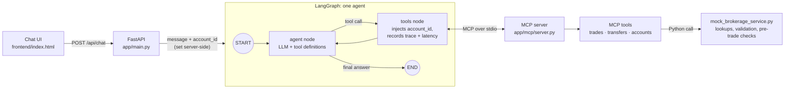

# Brokerage Customer Support Agent

An AI customer support agent for investment brokerage accounts that uses LangGraph and MCP tools to resolve customer-specific trade, transfer, and account restriction questions.

A customer asks *"Did my NVDA trade go through?"*. The agent picks the right brokerage tool, the tool returns the customer's real account data over MCP, and the agent answers from that data. It doesn't guess or invent anything.

```
Customer: Did my NVDA trade go through?
Agent:    calls get_trade_status({"symbol": "NVDA"})            ← model chose the tool and filter
          MCP server → {"order_id": "ORD-7F3K-1001", "status": "FILLED",
                        "filled_quantity": 10, "average_fill_price": 118.42, ...}
Agent:    Yes, your buy order for 10 shares of NVDA (ORD-7F3K-1001) filled:
          10 shares at an average price of $118.42.
```

## What it does

The agent handles three of the most common brokerage support questions:

| Customer asks | Tool the agent calls | What the tool returns |
|---|---|---|
| "Did my NVDA trade go through?" | `get_trade_status` | order ID, side, quantity, status, filled quantity, average fill price, pending/rejection reason |
| "Where is the $5,000 I transferred from my checking account?" | `get_transfer_status` | transfer ID, amount, direction, status, initiated date, expected availability date, failure reason |
| "Why can't I place this trade?" | `get_account_restrictions` | buying power, unsettled funds and settlement date, restrictions, whether a given order can be placed and why not |

### Who does what

The core design rule is that each part does only what it is good at.

| The LLM | The application and tools |
|---|---|
| Understands the customer's question | Retrieve account data |
| Picks the tool and its filters | Return typed, structured results |
| Writes the natural-language answer | Validate input (tickers, amounts, quantities) |
| | Make deterministic decisions, e.g. "this order is blocked because $1,189.00 > $412.55 buying power" |
| | Decide **whose** account is read |

The last row matters. The model never sees an `account_id` parameter. The agent strips it from every tool definition it shows the model, then fills it in from the signed-in session before calling the tool. So the model can't read another customer's account, and a prompt injection can't talk it into doing so. A test covers this with a deliberately misbehaving model.

## Architecture



- **One agent, one loop.** The graph is `START → agent → tools → agent → END`, with no multi-agent orchestration.
  - The **agent** node calls the LLM.
  - If the LLM asks for a tool, the **tools** node runs it and loops back, so the LLM can write the answer from the result.
- **A real MCP boundary.** On startup, FastAPI launches the MCP server as a subprocess and keeps one MCP session open (via `langchain-mcp-adapters`). The agent only knows the tools that server advertises. Moving the server to its own host later means switching the transport from stdio to streamable HTTP; the tools don't change.
- **Thin tools, logic in the service.** Each MCP tool describes itself and calls one service function through a shared `run_tool` helper, which returns JSON or a structured error. The service owns lookups, validation and the pre-trade checks. To go live, you replace the service's mock data with calls to real brokerage APIs and keep its function signatures and return models. The tools, agent and UI stay the same.

## Tech stack

- **Python 3.11+**
- **FastAPI** for the API, and to serve the chat page
- **LangGraph** for the agent graph (`StateGraph` with an agent node and a tools node)
- **LangChain** for the chat model interface (`langchain-anthropic`) and the MCP tool adapters (`langchain-mcp-adapters`)
- **MCP**, using the official Python SDK's `FastMCP`, for the brokerage tool server
- **Pydantic** models as the data contract between layers
- **Claude** (`claude-sonnet-5-5` by default) as the LLM, with an offline stand-in when no API key is set
- Plain HTML/CSS/JS for the UI, with no build step

## Quick start

```bash
cd agents/brokerage-support-agent
python -m venv .venv && source .venv/bin/activate
pip install -r requirements.txt

export ANTHROPIC_API_KEY=...        # optional, see below
uvicorn app.main:app --reload
```

Open http://localhost:8000 and click a suggested question.

**No API key?** The app still runs. Without `ANTHROPIC_API_KEY`, it uses `MockBrokerageChatModel`, an offline stand-in that picks tools with keyword rules and phrases the tool results with templates. It isn't an LLM, and the page header says which model is answering. It's there so the demo and tests run without network access. Everything else is the same code path, including the MCP subprocess. Set `ANTHROPIC_MODEL` to use a different Claude model.

Other ways to run each layer:

```bash
python -m app.services.mock_brokerage_service              # the data layer alone
python -m app.mcp.client_demo                              # call the MCP tools with no LLM
python -m app.agent.cli "Did my NVDA trade go through?"    # the agent in a terminal
curl -s localhost:8000/api/chat -H 'Content-Type: application/json' \
  -d '{"message": "Where is my $5,000 transfer?"}'         # the HTTP API
```

## Demo script

Every answer in the UI has a **Tool trace** panel. Expand it to see:
- which MCP tool ran;
- the arguments the model chose;
- what the server injected (the account);
- the raw structured result;
- the tool latency.

The demo customer is `ACCT-DEMO-1001`, a fictional cash account.

| Ask | Tool | Outcome |
|---|---|---|
| Did my NVDA trade go through? | `get_trade_status` | **FILLED**: 10 shares @ $118.42 |
| Any update on my TSLA order? | `get_trade_status` | **PENDING**: limit price $265.00 not reached |
| What happened to my AMD order? | `get_trade_status` | **REJECTED**: cost exceeded buying power |
| Where is the $5,000 I transferred from my checking account? | `get_transfer_status` | **PROCESSING**: available 2026-10-05 |
| Show me my transfers | `get_transfer_status` | includes a **COMPLETED** $2,500 deposit |
| Did my $1,000 withdrawal go through? | `get_transfer_status` | **FAILED**: receiving bank account closed |
| Why can't I place this trade? | `get_account_restrictions` | buying power, unsettled funds, restrictions; asks which order |
| Can I buy 2 shares of NVDA? | `get_account_restrictions` | **No restriction**: allowed |
| Why can't I buy 10 shares of NVDA? | `get_account_restrictions` | **Unsettled funds**: covered once the AAPL sale settles on 2026-10-05 |
| Why can't I buy 25 shares of AMD? | `get_account_restrictions` | **Insufficient buying power** |
| Why can't I buy 1 share of GOOGL? | `get_account_restrictions` | **Account restriction**: insider pre-clearance required |

## The MCP tools

All three tools take an `account_id`, which the application supplies, plus optional filters, which the model supplies. They return structured JSON. Expected failures such as an unknown account, a bad ticker or a negative amount come back as `{"error": {"code", "message"}}`, so the agent can explain them instead of crashing.

### `get_trade_status(account_id, symbol?)`
Returns the account's orders, optionally for one ticker. Each order includes `order_id`, `symbol`, `side`, `quantity`, `status` (`FILLED`, `PENDING`, `REJECTED`), `filled_quantity`, `average_fill_price`, `submitted_at`, and `status_reason` (why it's pending or rejected).

### `get_transfer_status(account_id, amount?, direction?)`
Returns the account's bank transfers, optionally filtered by exact amount and by `DEPOSIT` or `WITHDRAWAL`. Each transfer includes `transfer_id`, `amount`, `direction`, `external_account` (masked), `status` (`PROCESSING`, `COMPLETED`, `FAILED`), `initiated_date`, `expected_available_date`, and `failure_reason`.

### `get_account_restrictions(account_id, symbol?, side?, quantity?)`
Returns `account_type`, `buying_power`, `unsettled_funds`, `unsettled_settlement_date`, and active `restrictions`, each with a description and how to resolve it.

If you pass symbol, side and quantity together, it also runs the pre-trade checks on that order:
- prices it with an indicative quote;
- checks restrictions on that symbol;
- checks cost against buying power, saying whether unsettled funds would cover it;
- for a sell, checks the shares held.

It then returns `proposed_order`, `can_place_order` and `blocking_reasons`, with codes `ACCOUNT_RESTRICTION`, `UNSETTLED_FUNDS`, `INSUFFICIENT_BUYING_POWER` and `INSUFFICIENT_SHARES`.

## Project structure

```
agents/brokerage-support-agent/
├── app/
│   ├── main.py                  FastAPI: starts the MCP subprocess; GET / and POST /api/chat
│   ├── config.py                demo account, MCP server launch settings
│   ├── agent/
│   │   ├── graph.py             LangGraph graph: agent node, tools node (account injection, traces)
│   │   ├── prompts.py           system prompt
│   │   ├── llm.py               Claude if ANTHROPIC_API_KEY is set, else the offline stand-in
│   │   ├── mock_llm.py          offline stand-in: keyword rules, not an LLM
│   │   └── cli.py               ask one question from the terminal
│   ├── mcp/
│   │   ├── server.py            FastMCP server; registers the tools; runs over stdio
│   │   ├── client_demo.py       lists and calls the tools without an LLM
│   │   └── tools/               trades.py, transfers.py, accounts.py, common.py (run_tool)
│   ├── services/
│   │   └── mock_brokerage_service.py   mock data, lookups, validation, pre-trade checks
│   └── models/
│       ├── brokerage.py         Pydantic models: the data contract
│       └── api.py               chat request/response, tool trace
├── frontend/index.html          single-file chat UI with tool trace panel
├── tests/                       service, MCP tools, agent graph, HTTP API
├── requirements.txt
└── pytest.ini
```

## Tests

```bash
pytest
```

| File | What it covers |
|---|---|
| `test_mock_brokerage_service.py` | every order, transfer and restriction scenario; validation errors |
| `test_mcp_tools.py` | each tool called through a real MCP client session (in-memory transport) |
| `test_agent.py` | the full graph for each of the three intents; `account_id` hidden from the model; a model-supplied `account_id` ignored |
| `test_api.py` | FastAPI end to end with the MCP server as a real subprocess; tool traces in the response |

The agent and API tests use the offline stand-in, so they check the plumbing and tool contracts, not how well an LLM picks tools. See the eval harness under Future improvements.

## Current limitations

- **Mock data.** All data is hard-coded in `mock_brokerage_service.py`. There's one demo customer, and dates and quotes are fixed: the as-of date is around 2026-10-02 and the quotes are indicative. All names, IDs and amounts are fictional.
- **No authentication.** The server uses a fixed demo account in place of a signed-in user.
- **No conversation memory.** Each message is answered on its own.
- **No database, no deployment setup.**

## Future improvements

- **Authentication.** Real login (OAuth/OIDC, sessions, MFA) in front of the API.
- **Customer identity from the authenticated context.** Take `account_id`, and which of a customer's accounts are in scope, from the verified session or token, never from the request body. The graph already injects it outside the LLM, so this is a change in one place.
- **Entitlement and authorization checks outside the LLM.** Enforce in the service or gateway layer that the caller may read this account and this kind of data (joint accounts, advisors, delegated access), and log every check.
- **Real brokerage integrations.** Implement the service functions against the order management system, money movement/ACH, account/risk and clearing APIs, plus a market data provider for quotes. Keep the same return models so the MCP tool contracts don't change.
- **Observability and tracing.** Add LangSmith or OpenTelemetry spans for each graph step and MCP call, structured logs with correlation IDs, and dashboards for tool latency, error rate and tokens per conversation. The tool trace in the UI is the first piece of this.
- **Retries and partial failures.** Timeouts, retries with backoff and circuit breakers on brokerage calls. When data can't be fetched, the agent should say exactly what's missing instead of guessing.
- **Human escalation.** A handoff tool that opens a ticket with the conversation context. Trigger it on low confidence, on request, or on sensitive topics such as disputes, fraud or complaints.
- **Eval harness and golden dataset.** Build a labeled set of real customer phrasings to score tool selection, argument accuracy, faithfulness to tool output (no invented facts) and tone. Run it in CI on every prompt or model change, combining deterministic checks with an LLM judge.
- Conversation memory, more tools (cancel or modify an order, positions, documents), and streaming responses.

## Build history

The project was built in small, runnable steps, one commit each:

1. Mock brokerage data and a trade status lookup: plain Python, no AI
2. `get_trade_status` as an MCP tool, plus a client that calls it with no LLM
3. LangGraph agent that answers "Did my NVDA trade go through?"
4. FastAPI chat endpoint
5. Chat UI
6. `get_transfer_status`, plus the shared `run_tool` error helper
7. `get_account_restrictions` with deterministic pre-trade checks
8. Tool trace in the UI, and this README
