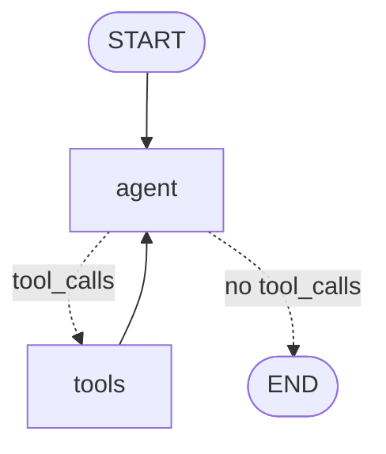

# Investment brokerage support agent (LangGraph scaffold, mock)

A minimal customer-support agent for an online brokerage, built with
[LangGraph](https://github.com/langchain-ai/langgraph). It answers three kinds
of questions for a logged-in customer by calling **read-only** tools:

| Question | Tool | Demo account | Mock answer |
|---|---|---|---|
| "Did my NVDA trade go through?" | `get_orders(account_id, ticker)` | `ACC-1001` (Alice) | Partially: 60 of 100 shares filled at avg $118.42 |
| "Where is my transfer?" | `get_transfers(account_id)` | `ACC-1002` (Bob) | $5,000 ACH deposit pending bank clearing, expected 2026-10-06 |
| "Why can't I place this trade? (buy 20 AAPL)" | `check_trade_eligibility(account_id, ticker, side, qty)` | `ACC-1003` (Carol) | Insufficient buying power: ~$4,550 needed, $1,250 available |

Everything is mocked: **no API key, no network, no MCP server.**

## Run

From the repo root:

```bash
python3 -m venv .venv && source .venv/bin/activate
pip install -r agents/investment_brokerage_support_agent/requirements.txt
python agents/investment_brokerage_support_agent/agent.py            # 3 demo questions
python agents/investment_brokerage_support_agent/agent.py -i --account ACC-1002   # simple REPL
```

The demo prints each tool call, the tool's JSON result, and the agent's final answer.

## Graph

```
START -> agent --(tools_condition: tool_calls?)--> tools -> agent -> ...
               \--(no tool_calls)-----------------> END
```



- **State**: `SupportState`, which is LangGraph's `MessagesState` (an append-only
  `messages` list) plus an optional `account_id`.
- **`agent` node**: builds the system prompt with the customer's `account_id`
  (from `config["configurable"]["account_id"]`, falling back to state) and calls
  the tool-bound chat model.
- **`tools` node**: LangGraph's prebuilt `ToolNode(TOOLS)` runs each tool call and
  appends `ToolMessage`s.
- **`tools_condition`**: prebuilt router; goes to `tools` if the last AI message
  has `tool_calls`, otherwise `END`.

## Mapping to `examples/langgraph_style_loop`

That example hand-writes the same loop in plain Python. Here LangGraph supplies the pieces:

| Hand-written (`examples/langgraph_style_loop/agent.py`) | This agent (LangGraph) |
|---|---|
| `state = {"messages": [...], "steps", "max_steps"}` | `MessagesState` (+ `account_id`); messages are appended by a reducer |
| `mock_llm(messages)` | `ScriptedFakeChatModel` (a real `BaseChatModel` with `bind_tools`) |
| `call_model(state)` | `agent` node |
| `call_tools(state)` + `TOOLS` dict + `json.loads(arguments)` | prebuilt `ToolNode(TOOLS)` with `@tool` functions |
| `route(state)` | prebuilt `tools_condition` |
| `max_steps` | `recursion_limit` in the run config |
| `run_graph()` while-loop | `StateGraph(...).compile()` then `.invoke()` / `.stream()` |

## What's mocked

- **Model**: `ScriptedFakeChatModel` in `agent.py`. It matches keywords in the
  question and emits an `AIMessage` with the right `tool_calls`. After the tool runs,
  it writes a final answer from the tool's JSON, so the answers are grounded in the
  tool output. It also refuses investment-advice questions ("Should I buy...") and
  escalates anything else to a human. Swap it in `get_model()`:

  ```python
  from langchain.chat_models import init_chat_model   # pip install langchain langchain-openai
  return init_chat_model("openai:gpt-4o-mini", temperature=0)
  ```

- **Data / tools**: `tools.py` holds hard-coded customers, orders (filled,
  partially_filled, pending, canceled, rejected), transfers (ACH, wire, ACATS), mock
  prices, and a restricted-securities list. `check_trade_eligibility` checks account
  holds, restricted securities, market hours, buying power, shares held (for sells),
  and PDT. It uses a fixed mock clock (`MOCK_NOW`, Fri 2026-10-02 11:30 ET) so the
  output is deterministic. The tools are read-only and never place or change anything.

## Next steps

1. **Real model**: replace the fake in `get_model()` (e.g. `init_chat_model("openai:gpt-4o-mini")`).
2. **MCP server**: move the tools behind an MCP server and load them with
   `langchain-mcp-adapters` (`MultiServerMCPClient(...).get_tools()`). The graph stays the same.
3. **Don't trust the model with `account_id`**: today the model passes `account_id` as
   a tool argument (the system prompt tells it which one to use). For production,
   inject it from the authenticated session (e.g. `InjectedToolArg` / `InjectedState`)
   so the model can't query another customer's account.
4. **FastAPI `/chat` endpoint**: wrap `build_graph()` behind an HTTP API, with a
   checkpointer (e.g. `MemorySaver`) and `thread_id` for multi-turn conversations.
5. **Evals**: a set of support questions plus an LLM-as-judge rubric (grounded in tool
   output? no investment advice? escalated when it should?), similar to
   `examples/legal_document_judge`.
